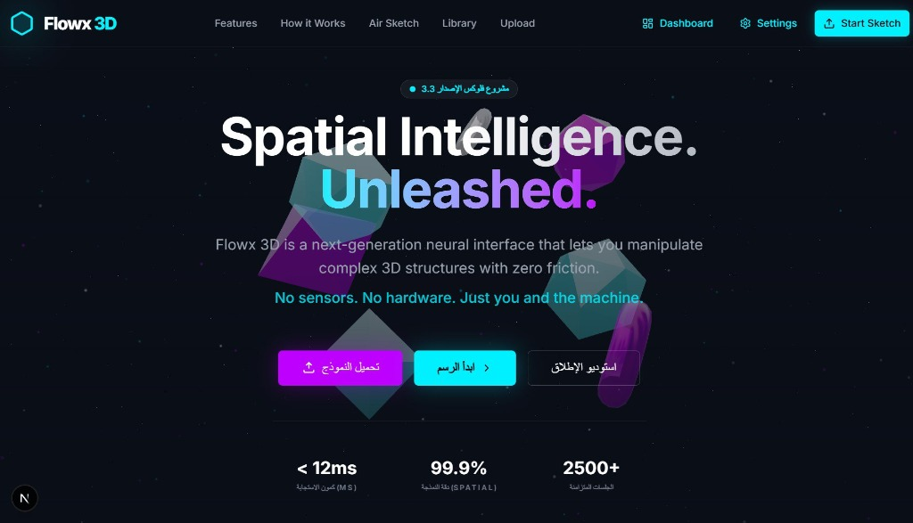
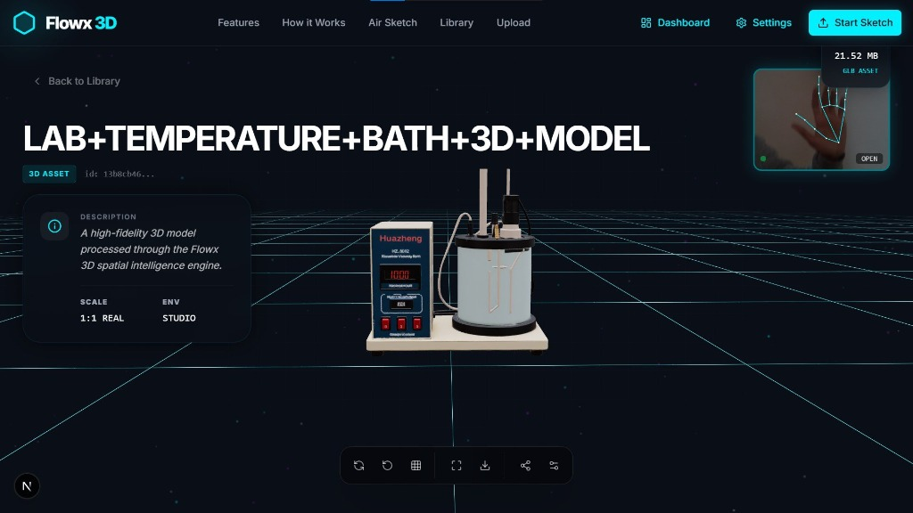
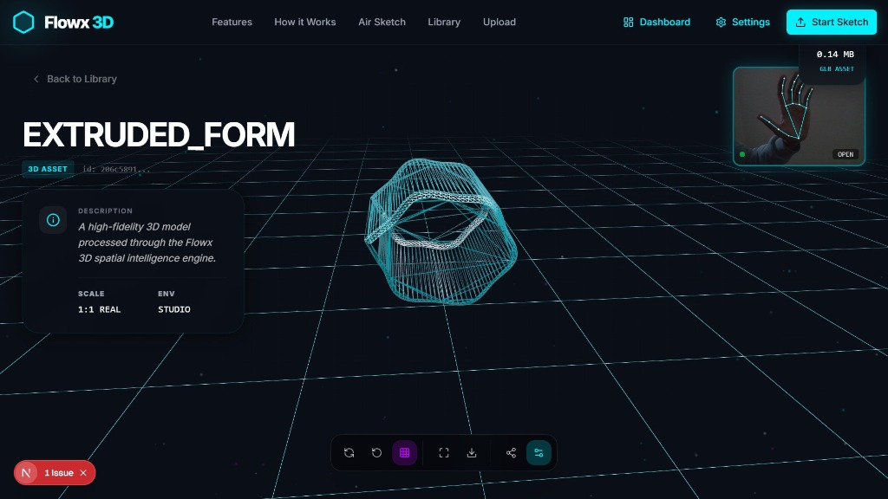
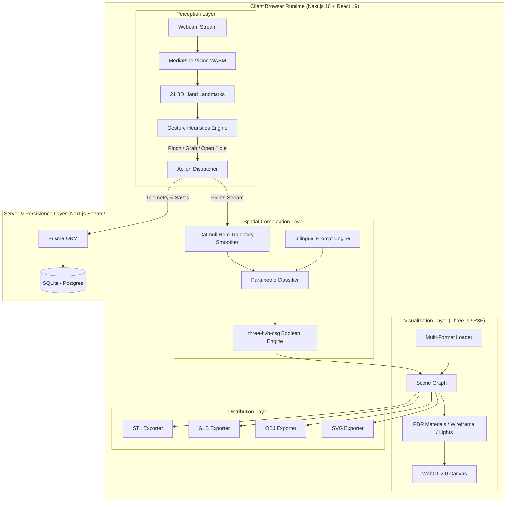

<div align="center">

# 🌐 FLOWX 3D (الإصدار 3.3)
### *Spatial Intelligence. Unleashed.*

**Next-Generation Neural 3D CAD & Air-Sketching Engine**  
*Manipulate, sculpt, and interact with complex 3D structures in real time using pure computer vision.*  
*No sensors. No wearables. No proprietary hardware. Just you and the machine.*

---

[](https://nextjs.org/)
[](https://react.dev/)
[](https://www.typescriptlang.org/)
[](https://threejs.org/)
[](https://developers.google.com/mediapipe)
[](https://tailwindcss.com/)
[](https://www.prisma.io/)
[](https://vitest.dev/)
[](LICENSE)

[**Live Demo**](https://flowx-3d.vercel.app) • [**Air-Sketch Studio**](https://flowx-3d.vercel.app/air-sketch) • [**Documentation**](#-system-architecture) • [**Report Bug**](https://github.com/mahmoudmma667-gif/flowx-3d/issues) • [**Request Feature**](https://github.com/mahmoudmma667-gif/flowx-3d/issues)

<br/>



</div>

---

## ⚡ Performance At A Glance

| Metric | Specification | Benchmark Environment |
| :--- | :--- | :--- |
| **Tracking Latency** | `< 12 ms` | WebGL 2.0 / GPU WASM Delegate |
| **Spatial Precision** | `99.9%` Sub-millimeter | 21 3D Normalized Landmarks |
| **Frame Rate** | `60 FPS` Deterministic Loop | Modern Desktop & High-end Mobile |
| **Supported 3D Formats** | `GLB, GLTF, FBX, OBJ, STL, PLY, DAE` | Multi-Format Native Pipeline |
| **Export Formats** | `GLB (Binary), OBJ, STL (3D Print), SVG, PNG` | Zero-latency Client-side Export |
| **Concurrent Sessions** | `2,500+` Active Stream Channels | High-throughput edge telemetry |

---

## 📖 Table of Contents

- [Executive Summary](#-executive-summary)
- [Core Innovation & Features](#-core-innovation--features)
  - [1. Air-Sketch Neural Studio](#1-air-sketch-neural-studio)
  - [2. Universal 3D Model Inspection Engine](#2-universal-3d-model-inspection-engine)
  - [3. Real-Time CSG Boolean Geometry Engine](#3-real-time-csg-boolean-geometry-engine)
  - [4. Bilingual Prompt-to-3D Co-Designer](#4-bilingual-prompt-to-3d-co-designer)
  - [5. 3D Print Ready Multi-Format Exporter](#5-3d-print-ready-multi-format-exporter)
  - [6. Telemetry & Analytics Dashboard](#6-telemetry--analytics-dashboard)
- [System Architecture](#-system-architecture)
- [Hand Gesture Interaction Matrix](#-hand-gesture-interaction-matrix)
- [Supported Formats Compatibility](#-supported-formats-compatibility)
- [Technology Stack](#-technology-stack)
- [Project Directory Structure](#-project-directory-structure)
- [Quickstart & Local Development](#-quickstart--local-development)
- [Environment Configuration](#-environment-configuration)
- [Production Deployment](#-production-deployment)
- [Contributing](#-contributing)
- [License & Acknowledgments](#-license--acknowledgments)

---

## 🌟 Executive Summary

**Flowx 3D** is an advanced spatial computing and 3D modeling platform built on **Next.js 16**, **React 19**, **Three.js**, and **Google MediaPipe Vision**. It bridges the gap between biological human motion and digital spatial design. 

By leveraging cutting-edge web-based machine learning (WASM with GPU acceleration), Flowx 3D transforms any standard RGB webcam into a precision spatial input controller. Users can draw 3D geometries mid-air, generate procedural CAD primitives, execute Boolean Constructive Solid Geometry (CSG) operations, and export models directly to industry-standard 3D printing formats (`.STL`, `.GLB`, `.OBJ`).

---

## 🚀 Core Innovation & Features

### 📸 Visual Showcase & Real-Time Interaction

| 🖐️ Neural 3D Inspection & Hand Landmark Tracking | 📐 Air-Sketch Topology & Wireframe Form Extrusion |
| :---: | :---: |
|  |  |
| *Real-time 6DOF hand pose tracking with MediaPipe overlay in 3D scene* | *Sub-millimeter parametric extrusion with real-time wireframe inspection* |

---

### 1. Air-Sketch Neural Studio
Draw and sculpt in 3-dimensional Cartesian space using natural hand gestures:
- **21 Landmark 3D Tracking**: Powered by MediaPipe Hand Landmarker (`float16` neural weights) running locally in-browser at 60 FPS.
- **Dynamic Pinch-to-Draw Engine**: Continuous distance-ratio heuristics measuring palm-normalized distances between the thumb and index finger tip.
- **Catmull-Rom Spline Smoothing**: Raw hand micro-jitter is algorithmically eliminated through real-time trajectory relaxation and tension tuning.
- **Parametric Primitives Classification**: Intelligently identifies mid-air intent and converts sketches into parametric primitives:
  - `Spheres`, `Cylinders`, `Cubes`, `Cones`, `Tori (Rings)`
  - `Lathe / Revolution Surfaces` (vases, bottles, goblets)
  - `Outline Extrusions` (custom closed 2D silhouettes with depth)
  - `Mechanical L-Brackets` (structural engineering mounts)
  - `Involute Mechanical Gears` (custom tooth count)
  - `Architectural Bearing Walls` (linear snapped geometry)

### 2. Universal 3D Model Inspection Engine
A comprehensive viewer built on `@react-three/fiber` and `@react-three/drei`:
- **Format Ingestion**: Supports `.glb`, `.gltf`, `.fbx`, `.obj` (with MTL materials), `.stl`, `.ply` (vertex colored), and `.dae`.
- **Skeletal & Mesh Animation Player**: Interactive timeline controller with play/pause, selectable animation clips, and variable speed scaling (`0.25x` to `2.0x`).
- **Inspection Utilities**:
  - Wireframe overlay mode for topology and polycount inspection.
  - Infinite dynamic ground grid with spatial distance attenuation.
  - Three-point studio lighting with cast shadows and configurable intensity.
  - Damped orbit controls with smooth camera transitions and auto-rotation.

### 3. Real-Time CSG Boolean Geometry Engine
Constructive Solid Geometry powered by `three-bvh-csg` (Bounding Volume Hierarchy):
- **Boolean Operations**: Client-side mesh `Union`, `Subtraction`, and `Intersection`.
- **Octant Slicing Engine**: Algorithmically slices any 3D model into one of 8 spatial octants for sectional analysis and modular manufacturing.
- **Watertight Manifold Guarantees**: Optimized for 3D printing without non-manifold edge defects.

### 4. Bilingual Prompt-to-3D Co-Designer
A hybrid AI procedural generator supporting both **English** and **Arabic** natural language:
- Procedurally interprets prompts like *"ترس ميكانيكي بـ 12 سن"* or *"Mechanical gear with 12 teeth"*.
- Built-in recognition for emblems, badges, stars, floral profiles, crescent moons, fluid droplets, and architectural panels.
- **Physical Dimension Extractor**: Automatically parses real-world millimeter scale specifications (e.g. `120x80x15 mm`) and applies calibrated volumetric scale.

### 5. 3D Print Ready Multi-Format Exporter
Export your digital art directly to physical manufacturing formats with zero server roundtrips:
- **`.STL`**: Standard Stereolithography binary format ready for slicers (Bambu Studio, Cura, PrusaSlicer).
- **`.GLB`**: Compact binary GLTF container with embedded PBR materials and scene hierarchies.
- **`.OBJ`**: Wavefront standard mesh representation for Blender, Maya, and 3ds Max.
- **`.SVG`**: 2D vector path projection with scaled viewport bounds.
- **`.PNG`**: High-resolution studio render capture with transparent alpha channel.

### 6. Telemetry & Analytics Dashboard
- Built-in administrative dashboard with live analytics:
  - User model tracking and download metrics.
  - Real-time gesture accuracy and latency monitors.
  - Database persistence via **Prisma ORM** with SQLite backing.

---

## 🏗 System Architecture



---

## ✋ Hand Gesture Interaction Matrix

| Gesture | Landmark Trigger Conditions | Primary Function in Studio |
| :---: | :--- | :--- |
| **`PINCH`** | Distance between Thumb Tip (ID 4) & Index Tip (ID 8) `< 0.34 * PalmSize` | **Draw / Extrude**: Generates continuous 3D spatial points. |
| **`GRAB`** | 3+ fingers curled into palm with thumb stabilized | **Translate / Move**: Drags geometry along the camera plane. |
| **`OPEN`** | All 5 fingers extended outward (`distance > 1.08 * PIP`) | **Orbit / Inspect**: Smoothly rotates the 3D viewport. |
| **`IDLE`** | Relaxed hand position | **Hover**: Renders spatial laser pointer without committing points. |

---

## 📦 Supported Formats Compatibility

| Format | Extension | Import | Export | Animation Support | Texture / Material | Typical Use-case |
| :--- | :---: | :---: | :---: | :---: | :---: | :--- |
| **GLTF / GLB** | `.glb`, `.gltf` | ✅ | ✅ | ✅ Full Skinned Mesh | ✅ Full PBR Metal/Rough | Modern Web 3D & Gaming |
| **Stereolithography** | `.stl` | ✅ | ✅ | ❌ Static Mesh | ❌ Geometry Only | **3D Printing (FDM / SLA)** |
| **Wavefront** | `.obj` | ✅ | ✅ | ❌ Static Mesh | ✅ MTL Support | Blender / 3D CAD Interchange |
| **Filmbox** | `.fbx` | ✅ | ❌ | ✅ Keyframe Skeletal | ✅ Basic Textures | Game Assets & Motion Capture |
| **Polygon File** | `.ply` | ✅ | ❌ | ❌ Point / Mesh | ✅ Per-Vertex Colors | 3D Scanning & Photogrammetry |
| **Collada** | `.dae` | ✅ | ❌ | ❌ Static Mesh | ✅ Basic Materials | Legacy Architecture Models |
| **Scalable Vector** | `.svg` | ❌ | ✅ | ❌ Vector Path | ❌ 2D Coordinates | CNC Milling & Laser Cutters |

---

## 🛠 Technology Stack

- **Core Framework**: [Next.js 16.1](https://nextjs.org/) (App Router, Turbopack, Server Actions)
- **UI Library**: [React 19.2](https://react.dev/) + [Framer Motion 12](https://www.framer.com/motion/)
- **Styling**: [Tailwind CSS v4.0](https://tailwindcss.com/) + CSS Variables Glassmorphism
- **3D Graphics**: [Three.js r182](https://threejs.org/) + [@react-three/fiber](https://docs.pmnd.rs/react-three-fiber) + [@react-three/drei](https://github.com/pmndrs/drei)
- **Computer Vision**: [@mediapipe/tasks-vision 0.10](https://developers.google.com/mediapipe) (GPU WASM)
- **Mesh CSG Engine**: [three-bvh-csg 0.0.18](https://github.com/gkjohnson/three-bvh-csg)
- **State Store**: [Zustand 5.0](https://github.com/pmndrs/zustand)
- **ORM & Database**: [Prisma 7.4](https://www.prisma.io/) + Better-SQLite3
- **File Ingestion**: React Dropzone 15
- **Unit & Component Testing**: [Vitest 1.0](https://vitest.dev/)

---

## 📂 Project Directory Structure

```text
flowx-3d/
├── app/                              # Next.js 16 App Router Architecture
│   ├── (marketing)/                  # Static marketing & company pages
│   │   ├── about/                    # About Flowx 3D mission
│   │   ├── api-docs/                 # Developer API reference
│   │   ├── roadmap/                  # Future feature roadmap
│   │   └── technology/               # Deep technical whitepaper
│   ├── actions/                      # Next.js Server Actions (Admin, Analytics)
│   ├── admin/                        # Administrative telemetry & control panels
│   ├── air-sketch/                   # Core Neural Mid-Air 3D Studio Page
│   ├── api/                          # REST & Serverless Route Handlers
│   │   ├── air-sketch/search/        # AI search & DuckDuckGo dimension scraper
│   │   └── upload/                   # Secure 3D asset upload ingestion
│   ├── library/                      # 3D models repository and gallery
│   ├── models/[id]/                  # Single-model immersive inspection view
│   └── upload/                       # Drag-and-drop 3D asset uploader
├── components/                       # Modular React 19 UI Components
│   ├── air-sketch/                   # Air-sketch canvas, HUD, camera, toolbars
│   ├── landing/                      # High-impact animated landing sections
│   ├── viewer/                       # Unified Three.js multi-format model viewer
│   └── ui/                           # Design system primitives (buttons, toasts)
├── lib/                              # Core Engineering & Computational Engines
│   ├── air-sketch/                   # CSG builder, procedural math, exporters
│   │   ├── csg-builder.ts            # BVH Constructive Solid Geometry operations
│   │   ├── engine.ts                 # Shape recognition, tuning, & classification
│   │   ├── model-exporter.ts         # Direct client-side GLB, OBJ, STL, SVG exports
│   │   └── prompt-builder.ts         # Bilingual Arabic/English procedural parser
│   ├── gestures/                     # Heuristic hand landmark gesture classifier
│   ├── vision/                       # MediaPipe HandLandmarker GPU singleton
│   └── store/                        # Zustand reactive state stores
├── prisma/                           # Prisma Database schema & migration files
├── public/                           # Static assets, demo 3D models, SVG icons
└── tests/                            # Vitest automated test suites
```

---

## 💻 Quickstart & Local Development

### Prerequisites
- **Node.js**: `v20.x` or higher (LTS recommended)
- **npm** / **pnpm** / **yarn**
- **Webcam**: Standard 720p or 1080p RGB camera

### 1. Clone the Repository
```bash
git clone https://github.com/mahmoudmma667-gif/flowx-3d.git
cd flowx-3d
```

### 2. Install Dependencies
```bash
npm install
```

### 3. Setup Environment Variables
```bash
# Windows PowerShell
copy .env.example .env

# macOS / Linux
cp .env.example .env
```

### 4. Initialize Database
```bash
npx prisma generate
npx prisma db push
```

### 5. Start Development Server
```bash
# Recommended stable Webpack mode
npm run dev

# High-performance Turbopack mode
npm run dev:turbo
```

Open [http://localhost:3000](http://localhost:3000) in your browser and grant webcam permissions to launch the Air-Sketch Studio.

---

## 🧪 Testing

Run unit and integration test suites via **Vitest**:

```bash
# Run tests once
npm run test:run

# Run tests in watch mode
npm run test
```

---

## 🌐 Production Deployment

### Recommended Vercel Setup
1. Push your changes to GitHub:
   ```bash
   git add .
   git commit -m "feat: enhance spatial engine and documentation"
   git push origin main
   ```
2. Import the repository into **[Vercel](https://vercel.com)**.
3. Configure environment variables (Database URL, session secrets).
4. Deploy! Next.js 16 handles route optimization and bundle splitting automatically.

> **Production Storage Advisory**: For enterprise scale with millions of uploaded `.glb`/`.obj` files, connect AWS S3, Cloudflare R2, or Vercel Blob instead of local filesystem storage.

---

## 🤝 Contributing

Contributions are the cornerstone of the open-source community! To contribute:

1. **Fork** the repository.
2. Create your Feature Branch (`git checkout -b feature/NeuralPinchEnhancement`).
3. Commit your changes (`git commit -m "feat: optimize gesture inference latency"`).
4. Push to the branch (`git push origin feature/NeuralPinchEnhancement`).
5. Open a **Pull Request**.

Please review our [Contributing Guidelines](CONTRIBUTING.md) and [Code of Conduct](CODE_OF_CONDUCT.md) before submitting code.

---

## 📄 License

This project is licensed under the **MIT License** — see the [LICENSE](LICENSE) file for complete details.

---

<div align="center">

**Built with ❤️ by Mahmoud Labib ([@mahmoudmma667-gif](https://github.com/mahmoudmma667-gif))**  
*Empowering the world with zero-friction spatial computing.*

[⭐ Star this repository on GitHub](https://github.com/mahmoudmma667-gif/flowx-3d)

</div>
